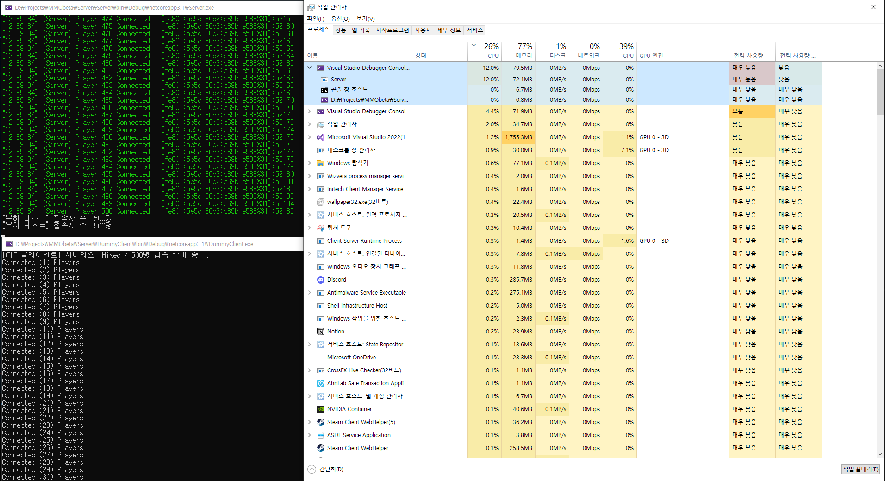
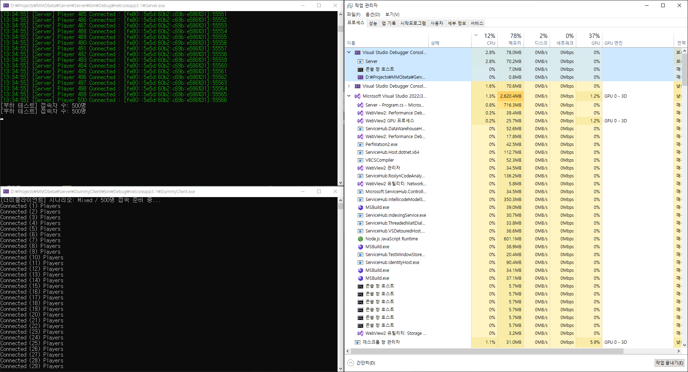
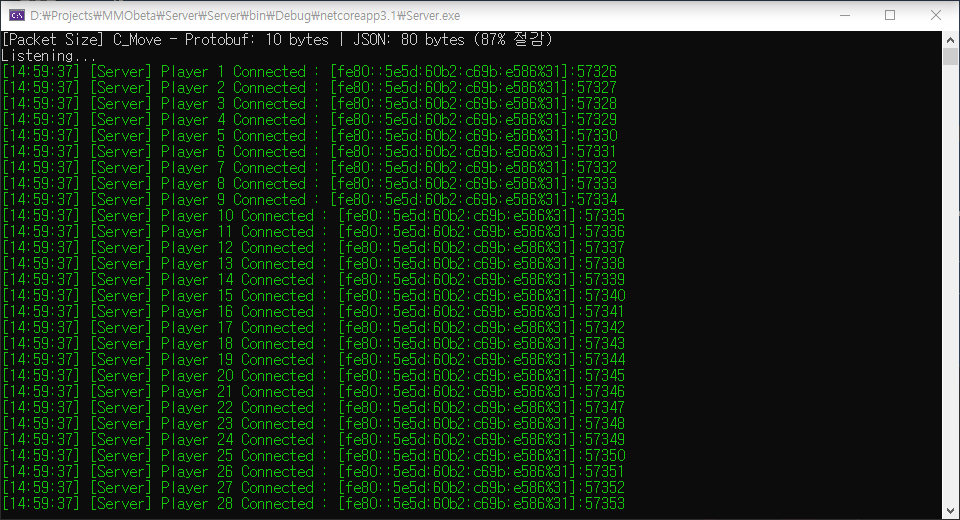

# MMO Server

C#과 .NET으로 만든 실시간 MMO 게임 서버입니다. 더미클라이언트 500명, 몬스터 500마리 환경에서 

직접 부하 테스트를 돌리며 서버의 CPU 사용률을 12%에서 2.8% 까지 감소시켰습니다.

---

## 실행 화면

Server / Unity Client / DummyClient 접속 완료 상태에서 Zone 시스템이 적용된 환경입니다.

더미클라이언트 200명, 몬스터 500마리 환경에서 유니티로 접속한 플레이어가 몬스터를 처치하는 장면입니다.


---

## 프로젝트 구조

```
MMObeta/
├── Server/
│   ├── ServerCore/        # 재사용 가능한 네트워크 엔진
│   ├── Server/            # MMO 게임 로직
│   ├── DummyClient/       # 부하 테스트용 더미 클라이언트
│   └── PacketGenerator/   # .proto → C# 패킷 코드 자동 생성기
├── Client/                # Unity 클라이언트
└── Common/
    └── MapData/           # 맵 벽/이동 가능 영역 데이터
```

---

## 실행 방법

> **개발 환경**: .NET Core 3.1, Unity 2019.4 (학습 목적으로 당시 강의 환경 유지)

1. Server 폴더의 솔루션 파일을 Visual Studio로 열기
2. **Server** 프로젝트를 시작 프로젝트로 설정 후 실행
3. Unity Hub에서 `Client/` 폴더를 열고 Play 버튼 클릭
4. (선택) 부하 테스트 시 **DummyClient** 프로젝트도 실행 (DummyClient/Program.cs에서 시나리오 설정 가능)

---

## 핵심 기능 설계

핵심적인 구조는 ServerCore, Server, Client(유니티)로 구성되어 있습니다.
ServerCore는 어떤 게임에도 붙일 수 있게 게임 로직을 넣지 않았고, 그 위에 실제 MMO 로직을 올리는 구조입니다.

### 1. Server Core (네트워크 엔진)
TCP 통신에서 반복적으로 처리해야 하는 것들을 모아두었습니다.

* **Listener**  

  연결 요청을 비동기로 받고, SocketAsyncEventArgs를 미리 풀로 만들어 재사용 했습니다.

  연결마다 객체를 새로 만들면 GC 부하가 생겨서 이 방식을 선택했습니다

* **Session.cs & PacketSession.cs** 

  TCP는 데이터가 쪼개져서 오거나 여러 패킷이 붙어서 올 수 있는데, 패킷이 다 모였을 때만 게임 로직으로 넘깁니다.

* **RecvBuffer.cs**  

  수신할 때마다 버퍼를 새로 할당하지 않고 미리 잡아둔 공간을 재사용합니다

---

### 2. Server (게임 로직)
여러 유저가 동시에 같은 공간에 있으면 필연적으로 **같은 데이터를 동시에 건드리는 문제**가 생깁니다. 

이걸 어떻게 처리하느냐가 핵심이었습니다.

* **JobQueue.cs & JobTimer.cs**
    * 여러 스레드가 게임 상태를 동시에 변경하면 race condition이 발생하기 때문에, 
    
      작업을 Queue에 쌓고 하나씩 순서대로 꺼내서 처리하였습니다.
    
    * 여러 스레드가 동시에 밀어 넣어도 실제 실행은 한 번에 하나씩만 됩니다
    
* **Zone 시스템**
  
    * 맵을 격자로 나눠서, 패킷이 발생한 위치 기준으로 시야 안에 있는 유저에게만 전송합니다
    
    * 이게 없으면 몬스터 한 마리가 움직일 때마다 접속 중인 모든 유저에게 패킷을 쏘게 됩니다. 
    
      실제로 CPU 사용률이 감소되는 효과를 직접 체감하였습니다 → [부하 테스트 결과](#부하-테스트-결과) 참고
    
* **Monster.cs (FSM 기반 AI)**
  
    * Idle → Moving(추적) → Skill → Dead 상태로 나눠서 몬스터 행동을 관리합니다

    * 스킬 판정, 피격, 사망까지 전부 서버에서 계산하고 클라이언트는 결과만 받습니다. 
    
      클라이언트에서 데미지 계산을 하면 조작이 가능해지기 때문입니다
    
* **Map.cs (A\* 경로 탐색)**
    * 몬스터가 벽을 피해서 플레이어를 쫓아오도록 A\*를 구현했습니다
    
    * 몬스터가 많으면 탐색 비용도 그만큼 커져서 `maxDist`로 탐색 범위를 제한했고, 
    
      경로를 못 찾으면 가장 가까운 위치로라도 이동하도록 처리했습니다

---

### 3. Client (유니티 연동)
유니티는 싱글 스레드라 백그라운드에서 패킷을 받아도 유니티 오브젝트를 직접 건드릴 수 없습니다. 

이 제약을 고려해서 구성했습니다.

* **PacketQueue.cs** 

  수신 스레드에서 받은 패킷을 큐에 쌓아두고

* **NetworkManager.cs** 

  매 프레임 메인 스레드에서 꺼내서 처리합니다

---

### 4. DummyClient (부하 테스트)
서버가 실제로 얼마나 버티는지 보려면 직접 돌려봐야 한다고 생각해서 만들었습니다.

* 500ms마다 이동 패킷, 1000ms마다 스킬 패킷을 자동으로 전송
* 이동 / 스킬 / 혼합 3가지 시나리오 선택 가능
* 서버와 동일한 맵 데이터를 로드해 이동 전 충돌 검증(CanGo)을 수행 — 서버가 거부할 패킷을 사전에 차단

---

## 기술 스택

### Server
- Language: C#
- Network: Windows IOCP (TCP)
- Serialization: Protobuf

### Client
- Engine: Unity
- Language: C#

---

## 부하 테스트 결과

**테스트 환경**: Windows 10 / Intel i5-10600KF @ 4.10GHz / RAM 16GB 

더미 클라이언트 500명 / 시나리오(이동) / 몬스터 500마리

| | Zone 적용 전 | Zone 적용 후 |
|:---:|:---:|:---:|
| **서버 CPU** | **12%** | **2.8%** |
| **전체 CPU** | 26% | 12% |

<table>
  <tr>
    <th align="center">Zone 적용 전</th>
    <th align="center">Zone 적용 후</th>
  </tr>
  <tr>
    <td></td>
    <td></td>
  </tr>
</table>

Zone 적용 전에는 몬스터 한 마리가 움직일 때마다 접속 중인 500명 전원에게 패킷을 보냈습니다.
몬스터 500마리 기준으로 계산하면 초당 약 1,250,000번 전송이 일어나는 구조였고, 서버 CPU가 12%까지 올라갔습니다.
Zone을 붙이고 나서 시야 안의 유저에게만 보내도록 바꿨더니 서버 CPU가 **12% → 2.8%** 로 떨어졌습니다.

---

## 트러블슈팅

### 1. 접속자가 늘수록 연결이 끊기는 현상

- **증상**

    30명 부하 테스트 중 24번째 플레이어부터 접속하자마자 바로 끊김.
    혼자 접속하면 괜찮은데 사람이 많아질수록 심해지는 패턴

- **원인**

    새 플레이어가 입장하면 서버는 현재 접속 중인 모든 플레이어 목록을 담아 `S_Spawn` 패킷으로 보내는데,
    사람이 늘수록 패킷도 그만큼 커지는 구조
    수신 버퍼가 1024 byte로 고정돼 있어서 일정 인원을 넘으면 패킷이 버퍼를 초과 -> 즉시 연결 종료

- **해결**

    버퍼를 1024 byte -> 65,535 byte로 늘렸고, 
    
    이 숫자는 패킷 헤더 타입인 `ushort`의 최댓값이라 단일 패킷이 물리적으로 이 크기를 넘을 수 없음
    
    근본적으로는 패킷에 전체 플레이어를 담지 않고 시야 안의 플레이어만 담도록 설계해야 함.

---

### 2. 부하 테스트 중 간헐적 서버 크래시

- **증상**

    부하 테스트 중 서버가 크래시. 발생 타이밍이 일정하지 않음

    ```
    System.NullReferenceException
    at GameObject.OnDead(GameObject attacker)
    ```

- **원인**

    서버에는 패킷을 주고받는 네트워크 스레드와 게임 로직을 처리하는 게임 스레드가 동시에 돌고 있는데,
    네트워크 스레드가 플레이어 퇴장 처리(`LeaveGame`)를 직접 실행하는 구조였음.
    두 스레드가 `Room` 객체를 동시에 건드리는 타이밍이 겹치면 크래시 발생

    ```
    게임 스레드:    OnDead() 실행 중 → Room 확인 ✓ → 다음 줄 실행 직전
    네트워크 스레드: (동시에) 퇴장 처리 → Room = null
    게임 스레드:    Room 사용 → NullReferenceException
    ```

- **해결**

    게임 로직 전용 Task를 별도로 만들고, 네트워크 스레드는 작업을 큐에 등록만 하도록 변경.
    게임 상태 변경은 전용 Task 하나만 처리하므로 동시 접근이 구조적으로 차단됨

    ```csharp
    // 변경 전: 네트워크 스레드가 직접 게임 상태 변경
    OnDisconnected() { room.LeaveGame(id); }
    
    // 변경 후: 큐에 등록만, 실행은 게임 전용 Task가
    OnDisconnected() { room.Push(() => room.LeaveGame(id)); }
    ```

---

### 3. 크래시 해결 후 몬스터가 전부 멈춤

- **증상**

    2번 문제를 고치고 나서 몬스터가 스폰 직후부터 Idle 상태로 굳어버림. 플레이어가 옆에 있어도 반응 없음.
    
- **원인**

    - 기존에는 `GameRoom.Update()`가 매 틱 모든 몬스터를 직접 돌면서 `Update()`를 호출하는 구조
      - 게임 전용 Task 구조로 바꾸면서 `GameRoom.Update()`가 큐 처리만 하도록 단순해짐.

    - 몬스터를 순회하던 코드가 사라진 걸 놓친 것

    ```
    기존 작동 구조: GameRoom.Update() → 몬스터 전부 순회 → monster.Update() 호출
    task 구조 후 변경된 구조: GameRoom.Update() → 큐 처리만 하고 끝
    결과: 입장 시 Update() 1번 → 이후 아무것도 호출 안 됨 → 영구 정지
    ```

- **해결**

    몬스터가 `Update()` 끝에 스스로 200ms 후에 다시 실행을 예약하는 방식으로 변경.
    죽을 때는 예약을 취소해서 죽은 몬스터가 계속 실행되는 문제도 함께 막음

    ```csharp
    IJob _job;
    
    public override void Update()
    {
        // AI 로직 (Idle / 추적 / 스킬 / 사망)
        if (Room != null)
            _job = Room.PushAfter(200, Update); // 200ms 후 다시 실행
    }
    
    public override void OnDead(GameObject attacker)
    {
        if (_job != null) { _job.Cancel = true; _job = null; } // 죽으면 예약 취소
        base.OnDead(attacker);
    }
    ```

---

## 설계 고민

**1. 패킷 클래스를 매번 손으로 짜야 할까?  [Protobuf 자동화]**

기존에는 패킷이 추가될 때마다 클래스를 직접 만들고 직렬화 코드도 따로 작성했습니다.

Protobuf 도입 후에는 `.proto` 파일에 구조만 정의하면 패킷 클래스와 핸들러 코드가 자동으로 생성되었습니다.

그리고 패킷 크기도 C_Move 기준으로 JSON 80 bytes에서 Protobuf 10 bytes로 줄었습니다. **(87% 절감)**



**2. 클라이언트가 데미지를 조작한다면? [서버 권위 구조]**

클라이언트가 피격 정보를 계산해서 보내는 구조는 값을 바꿔치기하면 그냥 통과됩니다.

클라이언트는 스킬을 썼다는 입력만 보내고, 투사체 이동부터 타격 판정, 체력 차감 등을 전부 서버에서 계산합니다.

---

## 미구현 / 개선 예정

* **로그인 & 데이터 저장**
    * 계정 생성 및 로그인 처리
    * 플레이어 데이터(스탯, 인벤토리 등) DB 저장 및 불러오기 (Entity Framework Core 활용 예정)

* **아이템 & 인벤토리 시스템**
    * 몬스터 처치 시 아이템 드롭 및 획득
    * 인벤토리 관리, 장비 착용

* **서버 분리 구조**
    * 현재는 게임 서버 하나로 모든 처리를 담당
    * 게임 서버 / 계정 서버 분리 구조로 전환 예정

* **Ping / Pong (유령 연결 감지)**
    * 네트워크가 끊겼는데 서버는 연결되어 있다고 인식하는 상황 방지
    * 서버가 주기적으로 Ping을 보내고 Pong 응답이 없으면 강제로 연결을 종료하는 구조 적용
