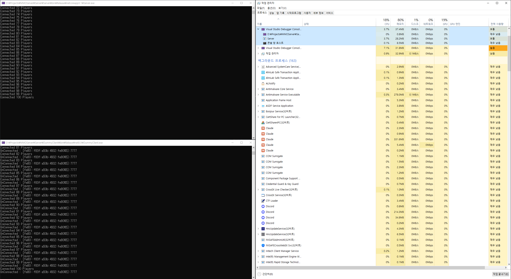
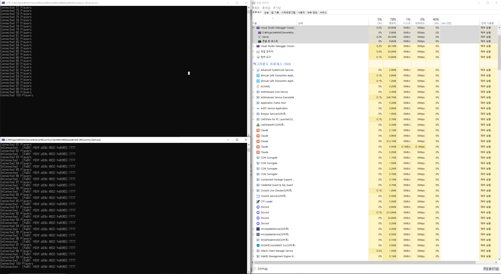
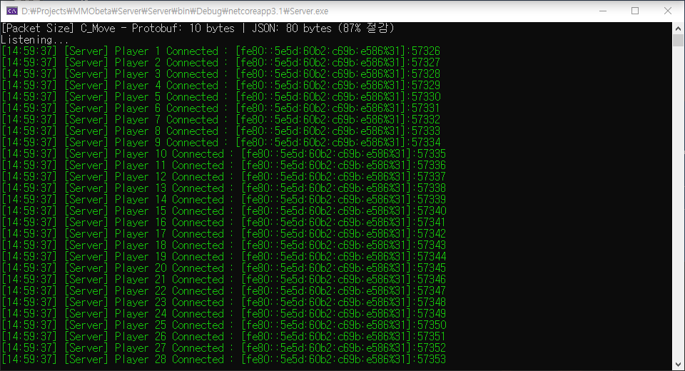

# MMO Server

C#과 .NET으로 만든 실시간 MMO 게임 서버입니다. 더미클라이언트 100명, 몬스터 100마리 환경에서 

직접 부하 테스트를 돌리며 서버의 CPU 사용률을 감소시켰습니다.

---

## 실행 화면

몬스터 100마리와 더미클라이언트 100명이 리스폰되는 상황에서, 

유니티 클라이언트 1명이 Zone 시스템이 적용된 환경에서 적을 처치하는 장면을 담은 플레이 화면입니다.  


---

## 프로젝트 구조

```
MMObeta/
├── Server/
│   ├── ServerCore/        # 재사용 가능한 네트워크 엔진
│   ├── Server/            # MMO 게임 로직
│   ├── DummyClient/       # 부하 테스트용 더미 클라이언트
│   └── PacketGenerator/   # .proto → C# 패킷 코드 자동 생성기
├── Client/                # Unity 클라이언트
└── Common/
    └── MapData/           # 맵 벽/이동 가능 영역 데이터
```

---

## 실행 방법

> **개발 환경**: .NET Core 3.1, Unity 2019.4

1. Server 폴더의 솔루션 파일을 Visual Studio로 열기
2. **Server** 프로젝트를 시작 프로젝트로 설정 후 실행
3. Unity Hub에서 `Client/` 폴더를 열고 Play 버튼 클릭
4. (선택) 부하 테스트 시 **DummyClient** 프로젝트 실행 

---

## 핵심 기능 설계

핵심적인 구조는 ServerCore, Server, Client(유니티)로 구성되어 있습니다.
ServerCore는 어떤 게임에도 붙일 수 있게 게임 로직을 넣지 않았고, 그 위에 실제 MMO 로직을 올리는 구조입니다.

### 1. Server Core (네트워크 엔진)
TCP 통신에서 반복적으로 처리해야 하는 것들을 모아두었습니다.

* **Listener**  

  연결 요청을 비동기로 받고, SocketAsyncEventArgs를 미리 풀로 만들어 재사용 했습니다.

  연결마다 객체를 새로 만들면 GC 부하가 생겨서 이 방식을 선택했습니다

* **Session.cs & PacketSession.cs** 

  TCP는 데이터가 쪼개져서 오거나 여러 패킷이 붙어서 올 수 있는데, 패킷이 다 모였을 때만 게임 로직으로 넘깁니다.

* **RecvBuffer.cs**  

  수신할 때마다 버퍼를 새로 할당하지 않고 미리 잡아둔 공간을 재사용합니다

---

### 2. Server (게임 로직)
여러 유저가 동시에 같은 공간에 있으면 필연적으로 **같은 데이터를 동시에 건드리는 문제**가 생깁니다. 

이걸 어떻게 처리하느냐가 핵심이었습니다.

* **JobQueue.cs & JobTimer.cs**
  
    * 여러 스레드가 게임 상태를 동시에 변경하면 race condition이 발생하기 때문에, 
    
      작업을 Queue에 쌓고 하나씩 순서대로 꺼내서 처리하였습니다.
    
    * 여러 스레드가 동시에 밀어 넣어도 실제 실행은 한 번에 하나씩만 됩니다
    
* **Zone 시스템**
  
    * 맵을 격자로 나눠서, 패킷이 발생한 위치 기준으로 시야 안에 있는 유저에게만 전송합니다
    
    * 이게 없으면 몬스터 한 마리가 움직일 때마다 접속 중인 모든 유저에게 패킷을 쏘게 됩니다. 
    
* **Monster.cs (FSM 기반 AI)**
  
    * Idle → Moving(추적) → Skill → Dead 상태로 나눠서 몬스터 행동을 관리합니다

    * 스킬 판정, 피격, 사망까지 전부 서버에서 계산하고 클라이언트는 결과만 받습니다. 
    
      클라이언트에서 데미지 계산을 하면 조작이 가능해지기 때문입니다

---

### 3. Client (유니티 연동)
유니티는 싱글 스레드라 백그라운드에서 패킷을 받아도 유니티 오브젝트를 직접 건드릴 수 없습니다. 

이 제약을 고려해서 구성했습니다.

* **PacketQueue.cs** 

  수신 스레드에서 받은 패킷을 큐에 쌓아두고

* **NetworkManager.cs** 

  매 프레임 메인 스레드에서 꺼내서 처리합니다

---

## 기술 스택

### Server
- Language: C#
- Network: Windows IOCP (TCP)
- Serialization: Protobuf

### Client
- Engine: Unity
- Language: C#

---

## 부하 테스트 결과

**테스트 환경**: Windows 10 / Intel i5-10600KF @ 4.10GHz / RAM 16GB / Release 빌드

**조건**: 더미 클라이언트 100 / 몬스터 100마리 / 동일 코드에서 UseZone 플래그만 변경

| | Zone 적용 전 | Zone 적용 후 |
|:---:|:---:|:---:|
| **서버 CPU** | 약 1.8% ~ 3.9% (평균 약 2.9%) | *약 0.1% ~ 0.3% (평균 약 0.2%)* |

<table>
  <tr>
    <th align="center">Zone 적용 전</th>
    <th align="center">Zone 적용 후</th>
  </tr>
  <tr>
    <td></td>
    <td></td>
  </tr>
</table>

- Zone 적용 전에는 몬스터 1마리가 움직일 때마다 접속자 전원에게 패킷을 전송

- Zone 적용 후에는 시야 범위 내 플레이어에게만 전송하여 서버 CPU 최소 약 5배 (평균 기준 약 15배) 감소

- 더 큰 규모에서는 Zone 미적용 시 정상 서비스 불가(스폰 지연·응답 마비), Zone 적용 시 정상 동작 

  → Zone 적용 시 더미클라이언트 500명 / 몬스터 500마리까지 동작 확인

---

## 설계 고민

**1. 패킷 클래스를 매번 손으로 짜야 할까?  [Protobuf 자동화]**

기존에는 패킷이 추가될 때마다 클래스를 직접 만들고 직렬화 코드도 따로 작성했습니다.

Protobuf 도입 후에는 `.proto` 파일에 구조만 정의하면 패킷 클래스와 핸들러 코드가 자동으로 생성되었습니다.

그리고 패킷 크기도 C_Move 기준으로 JSON 80 bytes에서 Protobuf 10 bytes로 줄었습니다. **(87% 절감)**



**2. 클라이언트가 데미지를 조작한다면? [서버 권위 구조]**

클라이언트가 피격 정보를 계산해서 보내는 구조는 값을 바꿔치기하면 그냥 통과됩니다.

클라이언트는 스킬을 썼다는 입력만 보내고, 투사체 이동부터 타격 판정, 체력 차감 등을 전부 서버에서 계산합니다.

---

## 미구현 / 개선 예정

* **로그인 & 데이터 저장**
    * 계정 생성 및 로그인 처리
    * 플레이어 데이터(스탯, 인벤토리 등) DB 저장 및 불러오기 (Entity Framework Core 활용 예정)
* **아이템 & 인벤토리 시스템**
    * 몬스터 처치 시 아이템 드롭 및 획득
    * 인벤토리 관리, 장비 착용
* **서버 분리 구조**
    * 현재는 게임 서버 하나로 모든 처리를 담당
    * 게임 서버 / 계정 서버 분리 구조로 전환 예정
